# RAG2Prod
Building an Agentic RAG System from Prototype to Production

## Development Stages
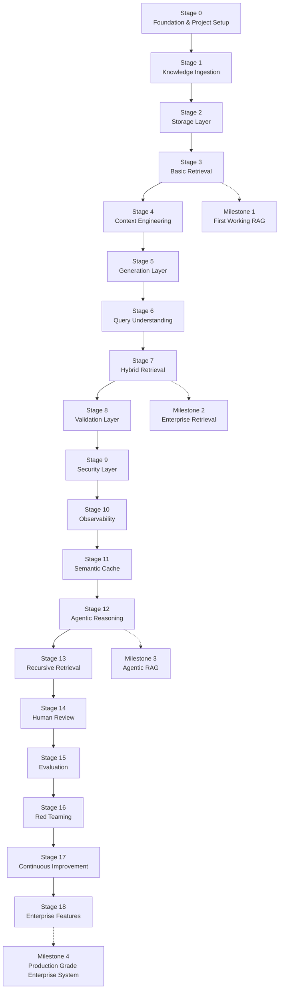

```mermaid
flowchart TD

S1["Stage 1
• Document Parsing
• Structure Extraction
• Chunking
• Metadata Generation
• Embeddings"]

S2["Stage 2
• Vector DB
• Postgres
• Object Storage"]

S3["Stage 3
• Dense Retrieval
• Metadata Filters"]

S4["Stage 4
• Context Builder
• Prompt Builder
• Citations"]

S5["Stage 5
• LLM Integration
• Structured Outputs"]

S6["Stage 6
• Intent Classification
• Query Rewriting
• Query Expansion"]

S7["Stage 7
• BM25
• Hybrid Fusion
• Reranking"]

S8["Stage 8
• Grounding Check
• Hallucination Detection
• Confidence Score"]

S9["Stage 9
• Authentication
• RBAC
• PII Detection"]

S10["Stage 10
• Logs
• Tracing
• Cost Monitoring"]

S11["Stage 11
• Query Cache
• Response Cache"]

S12["Stage 12
• Planner
• Tool Selection
• Tool Execution"]

S13["Stage 13
• Recursive Retrieval
• Evidence Loop"]

S14["Stage 14
• Human Approval Queue"]

S15["Stage 15
• Precision
• Recall
• Faithfulness"]

S16["Stage 16
• Prompt Injection Tests
• Adversarial Testing"]

S17["Stage 17
• Feedback Store
• Optimization Loops"]

S18["Stage 18
• Knowledge Graph
• Multi-Agent System
• Fine-Tuning Pipeline"]

S1 --> S2 --> S3 --> S4 --> S5 --> S6 --> S7 --> S8 --> S9 --> S10 --> S11 --> S12 --> S13 --> S14 --> S15 --> S16 --> S17 --> S18
```

## System Design

### High Level Architecture
```mermaid
flowchart LR

%% =====================================================
%% USER LAYER
%% =====================================================

User([User])

%% =====================================================
%% SECURITY
%% =====================================================

subgraph Security_and_Access_Control
    Auth[Authentication]
    RBAC[Authorization / RBAC]
    InputPII[Input PII Detection]
    RateLimit[Rate Limiting]
end

%% =====================================================
%% QUERY UNDERSTANDING
%% =====================================================

subgraph Query_Understanding
    Intent[Intent Classification]

    Complexity{Query Complexity}

    Rewrite[Query Rewriting]

    Expansion[Query Expansion]

    HyDE[HyDE Generation]

    MultiQuery[Multi Query Generation]

    CanonicalQuery[Canonical Query]
end

%% =====================================================
%% CACHE
%% =====================================================

subgraph Cache_Layer
    SemanticCache[Semantic Query Cache]
    ResponseCache[Response Cache]
end

%% =====================================================
%% RETRIEVAL
%% =====================================================

subgraph Hybrid_Retrieval
    Dense[Dense Retrieval]

    Sparse[BM25 Retrieval]

    Graph[Knowledge Graph Retrieval]

    MetadataFilter[Metadata Filtering]

    Fusion[Hybrid Fusion]

    Reranker[Cross Encoder Reranker]

    Compression[Context Compression]

    Dedup[Context Deduplication]
end

%% =====================================================
%% KNOWLEDGE STORES
%% =====================================================

subgraph Knowledge_Stores
    VectorDB[(Vector Database)]

    Postgres[(Postgres Database)]

    KG[(Knowledge Graph)]

    ObjectStore[(Object Storage)]
end

%% =====================================================
%% AGENTIC REASONING
%% =====================================================

subgraph Agentic_Reasoning
    Planner[Task Planner]

    Decompose[Task Decomposition]

    ToolSelect[Tool Selection]

    ToolExec[Tool Execution]

    ToolFailure{Tool Failed?}

    NeedMore{Need More Evidence?}

    Evidence[Evidence Aggregation]
end

%% =====================================================
%% CONTEXT ENGINEERING
%% =====================================================

subgraph Context_Engineering
    ContextBuilder[Context Builder]

    CitationBuilder[Citation Builder]

    PromptBuilder[Prompt Builder]
end

%% =====================================================
%% GENERATION
%% =====================================================

subgraph Generation
    LLM[Reasoning LLM]

    StructuredOutput[Structured Output]
end

%% =====================================================
%% OUTPUT SAFETY
%% =====================================================

subgraph Output_Guardrails
    OutputPII[Output PII Detection]

    PolicyCheck[Policy Validation]

    Toxicity[Toxicity Detection]

    Safety[Safety Validation]
end

%% =====================================================
%% VALIDATION
%% =====================================================

subgraph Validation
    Grounding[Grounding Verification]

    Hallucination[Hallucination Detection]

    Consistency[Consistency Check]

    Confidence[Confidence Scoring]
end

%% =====================================================
%% HUMAN REVIEW
%% =====================================================

subgraph Human_in_the_Loop
    HumanReview[Human Review Queue]

    Approved[Human Approved Response]
end

%% =====================================================
%% DELIVERY
%% =====================================================

subgraph Response_Delivery
    Streaming[Streaming Layer]

    FinalResponse[Final Response]
end

%% =====================================================
%% OBSERVABILITY
%% =====================================================

subgraph Observability
    Tracing[Distributed Tracing]

    Logs[Centralized Logging]

    Latency[Latency Metrics]

    Cost[Cost Monitoring]

    Tokens[Token Usage Analytics]
end

%% =====================================================
%% EVALUATION
%% =====================================================

subgraph Evaluation
    Precision[Retrieval Precision]

    Recall[Retrieval Recall]

    Faithfulness[Faithfulness]

    Relevance[Answer Relevance]

    LLMJudge[LLM Judge]

    Benchmark[Benchmark Suite]

    RedTeam[Red Team Testing]
end

%% =====================================================
%% CONTINUOUS IMPROVEMENT
%% =====================================================

subgraph Continuous_Improvement
    Feedback[Feedback Store]

    RetrievalTuning[Retrieval Tuning]

    PromptTuning[Prompt Optimization]

    AgentTuning[Agent Optimization]

    GuardrailTuning[Guardrail Updates]

    KnowledgeUpdates[Knowledge Updates]

    FineTune[Fine Tuning Dataset]
end

%% =====================================================
%% MAIN REQUEST FLOW
%% =====================================================

User --> Auth
Auth --> RBAC
RBAC --> InputPII
InputPII --> RateLimit

RateLimit --> Intent

Intent --> Complexity

Complexity -->|Simple| Rewrite

Complexity -->|Medium| Expansion

Complexity -->|Complex| HyDE

Rewrite --> CanonicalQuery

Expansion --> CanonicalQuery

HyDE --> MultiQuery

MultiQuery --> CanonicalQuery

CanonicalQuery --> SemanticCache

SemanticCache -->|Cache Hit| Streaming

SemanticCache -->|Cache Miss| Dense

%% =====================================================
%% RETRIEVAL FLOW
%% =====================================================

CanonicalQuery --> Dense
CanonicalQuery --> Sparse
CanonicalQuery --> Graph

VectorDB --> Dense

Postgres --> Sparse

KG --> Graph

Dense --> MetadataFilter
Sparse --> MetadataFilter
Graph --> MetadataFilter

MetadataFilter --> Fusion

Fusion --> Reranker

Reranker --> Compression

Compression --> Dedup

Dedup --> Planner

%% =====================================================
%% AGENT FLOW
%% =====================================================

Planner --> Decompose

Decompose --> ToolSelect

ToolSelect --> ToolExec

ObjectStore --> ToolExec

ToolExec --> ToolFailure

ToolFailure -->|Yes| Planner

ToolFailure -->|No| NeedMore

NeedMore -->|Yes| Dense

NeedMore -->|No| Evidence

Evidence --> ContextBuilder

%% =====================================================
%% GENERATION FLOW
%% =====================================================

ContextBuilder --> CitationBuilder

CitationBuilder --> PromptBuilder

PromptBuilder --> LLM

LLM --> StructuredOutput

StructuredOutput --> OutputPII

OutputPII --> PolicyCheck

PolicyCheck --> Toxicity

Toxicity --> Safety

Safety --> Grounding

Grounding --> Hallucination

Hallucination --> Consistency

Consistency --> Confidence

%% =====================================================
%% CONFIDENCE DECISION
%% =====================================================

Confidence --> Decision{Confidence OK?}

Decision -->|High| ResponseCache

Decision -->|Low| HumanReview

HumanReview --> Approved

Approved --> ResponseCache

%% =====================================================
%% DELIVERY
%% =====================================================

ResponseCache --> Streaming

Streaming --> FinalResponse

%% =====================================================
%% OBSERVABILITY
%% =====================================================

Intent -.-> Tracing

Dense -.-> Tracing

Sparse -.-> Tracing

Graph -.-> Tracing

Planner -.-> Tracing

ToolExec -.-> Tracing

LLM -.-> Tracing

Confidence -.-> Tracing

Tracing --> Logs

Logs --> Latency

Latency --> Cost

Cost --> Tokens

%% =====================================================
%% EVALUATION
%% =====================================================

Logs -.-> Precision

Logs -.-> Recall

Logs -.-> Faithfulness

Logs -.-> Relevance

Logs -.-> LLMJudge

Precision --> Benchmark

Recall --> Benchmark

Faithfulness --> Benchmark

Relevance --> Benchmark

LLMJudge --> Benchmark

Benchmark --> RedTeam

%% =====================================================
%% FEEDBACK LOOPS
%% =====================================================

HumanReview --> Feedback

Benchmark --> Feedback

RedTeam --> Feedback

Feedback --> RetrievalTuning

Feedback --> PromptTuning

Feedback --> AgentTuning

Feedback --> GuardrailTuning

Feedback --> KnowledgeUpdates

Feedback --> FineTune

RetrievalTuning -.-> Reranker

PromptTuning -.-> PromptBuilder

AgentTuning -.-> Planner

GuardrailTuning -.-> PolicyCheck

KnowledgeUpdates -.-> VectorDB

KnowledgeUpdates -.-> Postgres

KnowledgeUpdates -.-> KG

FineTune -.-> LLM
```
### Query Understanding Subsystem
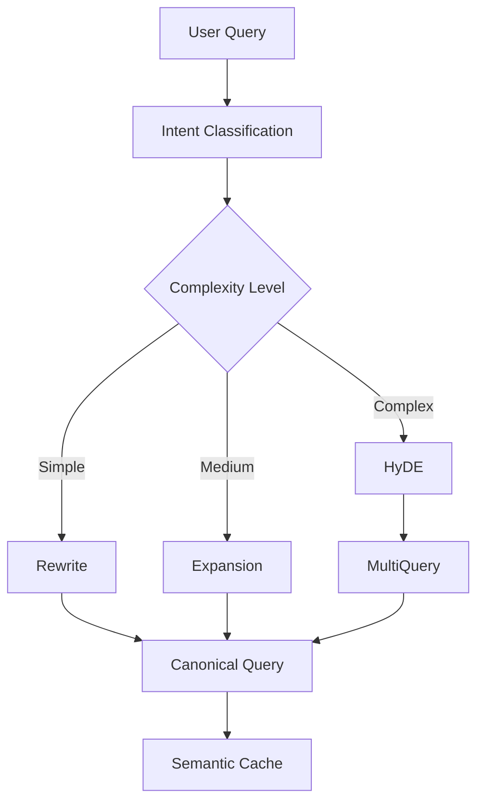

### Knowledge Ingestion Subsystem

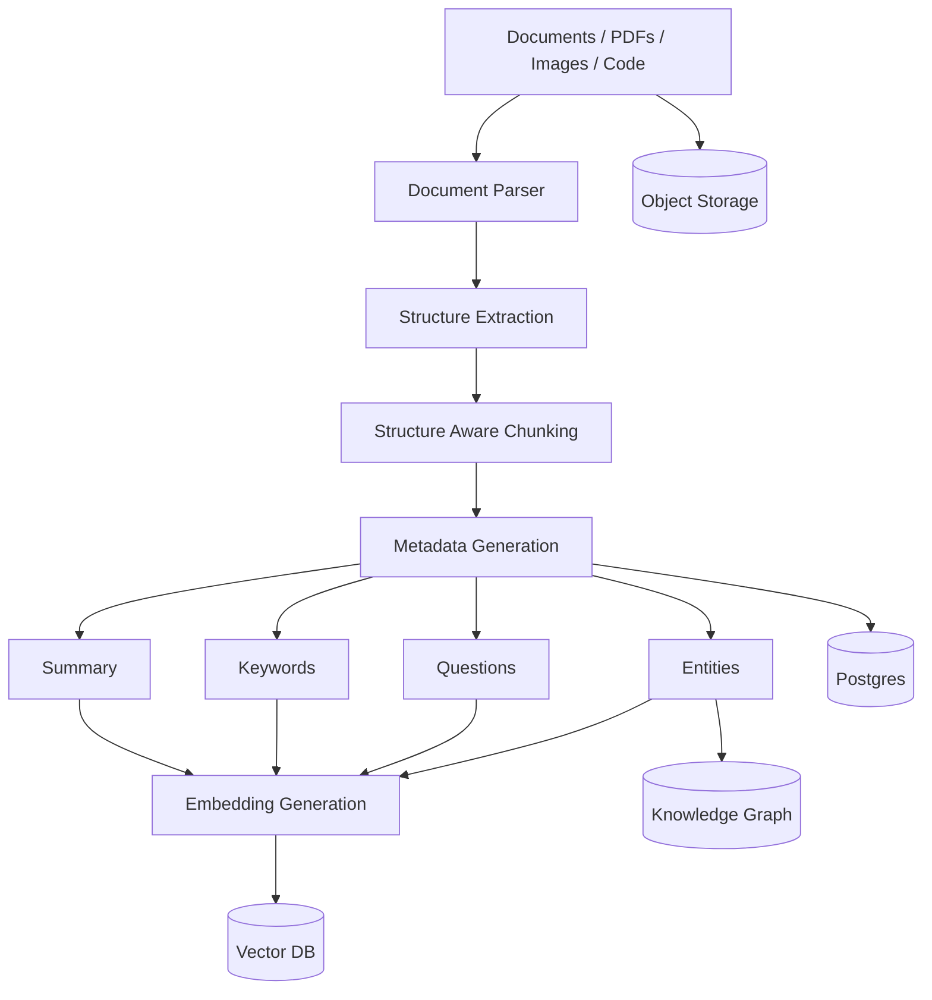

### Query Understanding Subsystem

### Hybrid Retrieval Subsystem
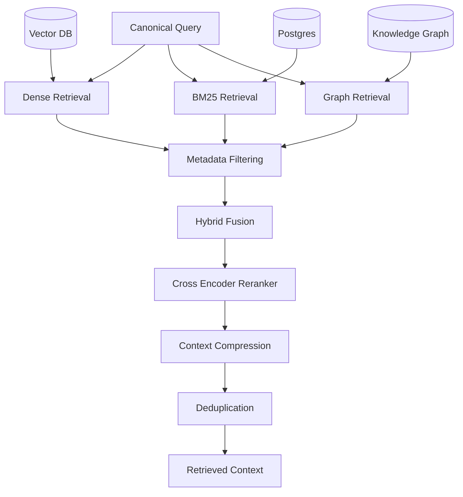

### Agentic Reasoning Subsystem

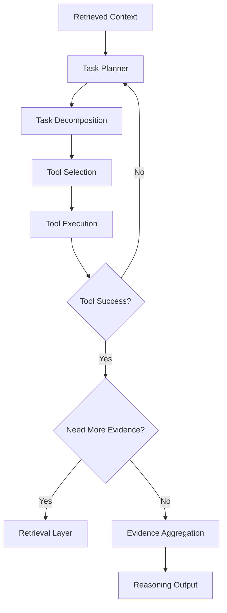

### Context Engineering Subsystem
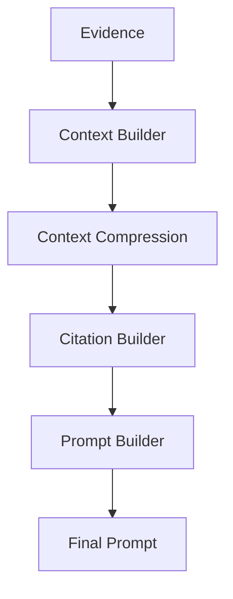

### Generation & Validation Subsystem

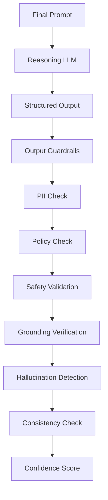

### Human Review Subsystem
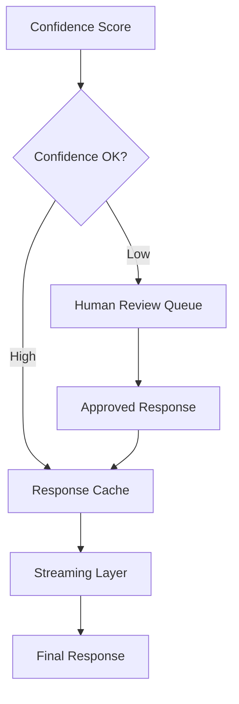

### Observability Subsystem
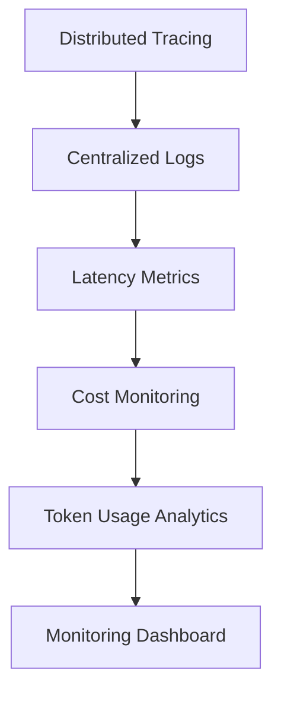

### Evaluation Subsystem
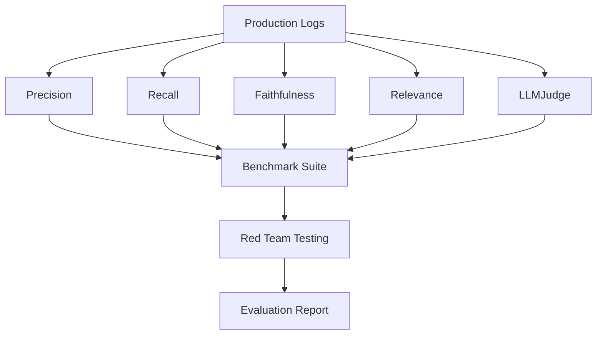

### Continuous Improvement Subsystem
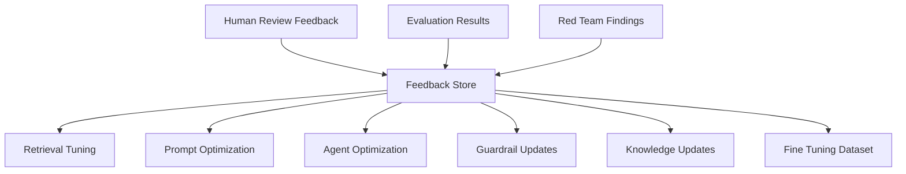
