# RAG2Prod
Building an Agentic RAG System from Prototype to Production

## Development Stages

### Development Roadmap

<details>
<summary><b>Click to expand Development Roadmap Diagram</b></summary>

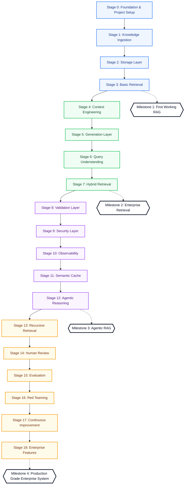
</details>

### Detailed Stage Checklist

#### **Milestone 1: First Working RAG**
* **Stage 0: Foundation & Project Setup**
  - [x] Repository Setup & Structure
  - [x] Config Management & Base dependencies
  - [x] CI/CD & Dev Environment Setup
* **Stage 1: Knowledge Ingestion**
  - [ ] Document Parsing & Structure Extraction
  - [ ] Chunking & Metadata Generation
  - [ ] Embedding Generation
* **Stage 2: Storage Layer**
  - [ ] Vector Database integration
  - [ ] Relational DB (Postgres) setup
  - [ ] Object Storage integration
* **Stage 3: Basic Retrieval**
  - [ ] Dense Vector Retrieval
  - [ ] Metadata Filtering

#### **Milestone 2: Enterprise Retrieval**
* **Stage 4: Context Engineering**
  - [ ] Context Builder
  - [ ] Prompt Builder
  - [ ] Citations Generator
* **Stage 5: Generation Layer**
  - [ ] LLM API Integration
  - [ ] Structured Output Generation
* **Stage 6: Query Understanding**
  - [ ] Intent Classification
  - [ ] Query Rewriting
  - [ ] Query Expansion
* **Stage 7: Hybrid Retrieval**
  - [ ] Sparse (FTS) Retrieval
  - [ ] Hybrid Fusion (RRF or Reciprocal Rank Fusion)
  - [ ] Cross-Encoder Reranking

#### **Milestone 3: Agentic RAG**
* **Stage 8: Validation Layer**
  - [ ] Grounding Verification
  - [ ] Hallucination Detection
  - [ ] Confidence Scoring
* **Stage 9: Security Layer**
  - [ ] Authentication & RBAC
  - [ ] Input/Output PII Detection
* **Stage 10: Observability**
  - [ ] Distributed Tracing
  - [ ] Centralized Logs
  - [ ] Latency & Cost Monitoring
* **Stage 11: Semantic Cache**
  - [ ] Semantic Query Caching
  - [ ] Exact Response Caching
* **Stage 12: Agentic Reasoning**
  - [ ] Task Planner & Decomposition
  - [ ] Tool Selection & Execution Loop

#### **Milestone 4: Production Grade Enterprise System**
* **Stage 13: Recursive Retrieval**
  - [ ] Recursive & Hierarchical Retrieval
  - [ ] Evidence Aggregation Loop
* **Stage 14: Human Review**
  - [ ] Human Approval Queue / Human-in-the-Loop interface
* **Stage 15: Evaluation**
  - [ ] Retrieval Precision & Recall metrics
  - [ ] Answer Relevance & Faithfulness (LLM Judge)
  - [ ] Benchmark Suite run
* **Stage 16: Red Teaming**
  - [ ] Prompt Injection Vulnerability testing
  - [ ] Adversarial testing suite
* **Stage 17: Continuous Improvement**
  - [ ] Feedback Store collection
  - [ ] Retrieval & Prompt Optimization loops
  - [ ] Auto-tuning datasets
* **Stage 18: Enterprise Features**
  - [ ] Knowledge Graph Retrieval
  - [ ] Multi-Agent Orchestration
  - [ ] Fine-Tuning Pipeline setup

## System Design

### High Level Architecture
<details>
<summary><b>Click to expand High Level Architecture Diagram</b></summary>

```mermaid
flowchart TD

subgraph Security_and_Access_Control
    Auth[Authentication]
    RBAC[Authorization / RBAC]
    InputPII[Input PII Detection]
    RateLimit[Rate Limiting]
end

subgraph Query_Understanding
    Intent[Intent Classification]
    Rewrite[Query Rewriting]
    Expansion[Query Expansion]
    HyDE[HyDE Generation]
end

subgraph Cache_Layer
    SemanticQueryCache[Semantic Query Cache]
end

subgraph Knowledge_Stores
    VectorDB[(Vector DB)]
    RelationalDB[(Relational DB)]
    GraphDB[(Graph DB)]
    ObjectStorage[(Object Storage)]
end

subgraph Hybrid_Retrieval
    Dense[Dense Vector Retrieval]
    Sparse[Sparse FTS Retrieval]
    Graph[Graph Retrieval]
    Filter[Metadata Filtering]
    Fusion[RRF Fusion]
    Reranker[Cross Encoder Reranker]
    ContextCompress[Context Compression]
    Dedup[Deduplication]
end

subgraph Agentic_Reasoning
    Planner[Task Planner]
    ToolSelect[Tool Selection]
    ToolExec[Tool Execution]
    ReasoningLoop{Reasoning Loop}
end

subgraph Context_Engineering
    ContextBuilder[Context Builder]
    CitationBuilder[Citation Builder]
    PromptBuilder[Prompt Builder]
end

subgraph Generation
    LLM[Reasoning LLM]
    StructuredOutput[Structured Output]
end

subgraph Output_Guardrails
    OutputPII[Output PII Detection]
    PolicyCheck[Policy Validation]
    Toxicity[Toxicity Detection]
    Safety[Safety Validation]
end

subgraph Validation
    Grounding[Grounding Verification]
    Hallucination[Hallucination Detection]
    Consistency[Consistency Check]
    Confidence[Confidence Scoring]
end

subgraph Human_in_the_Loop
    HumanReview[Human Review Queue]
    Approved[Human Approved Response]
end

subgraph Response_Delivery
    ResponseCache[Response Cache]
    Streaming[Streaming Layer]
    FinalResponse[Final Response]
end

subgraph Observability
    Tracing[Distributed Tracing]
    Logs[Centralized Logging]
    Latency[Latency Metrics]
    Cost[Cost Monitoring]
    Tokens[Token Usage Analytics]
end

subgraph Evaluation
    Precision[Retrieval Precision]
    Recall[Retrieval Recall]
    Faithfulness[Faithfulness]
    Relevance[Answer Relevance]
    LLMJudge[LLM Judge]
    Benchmark[Benchmark Suite]
    RedTeam[Red Team Testing]
end

subgraph Continuous_Improvement
    Feedback[Feedback Store]
    RetrievalTuning[Retrieval Tuning]
    PromptTuning[Prompt Optimization]
    AgentTuning[Agent Optimization]
    GuardrailTuning[Guardrail Updates]
    KnowledgeUpdates[Knowledge Updates]
    FineTune[Fine Tuning Dataset]
end

%% --- Main Request Flow ---
User([User]) --> Auth
Auth --> RBAC
RBAC --> InputPII
InputPII --> RateLimit

RateLimit --> Intent

Intent --> Complexity
Complexity -->|Simple| Rewrite
Complexity -->|Medium| Expansion
Complexity -->|Complex| HyDE

Rewrite --> CanonicalQuery
Expansion --> CanonicalQuery
HyDE --> MultiQuery
MultiQuery --> CanonicalQuery

CanonicalQuery --> SemanticCache
SemanticCache -->|Cache Hit| Streaming
SemanticCache -->|Cache Miss| Dense

%% --- Knowledge Store Inputs ---
VectorDB --> Dense
Postgres --> Sparse
KG --> Graph
ObjectStore --> ToolExec

%% --- Retrieval Flow ---
Dense --> MetadataFilter
Sparse --> MetadataFilter
Graph --> MetadataFilter
MetadataFilter --> Fusion
Fusion --> Reranker
Reranker --> Compression
Compression --> Dedup
Dedup --> Planner

%% --- Agent Reasoning Loop ---
Planner --> Decompose
Decompose --> ToolSelect
ToolSelect --> ToolExec
ToolExec --> ToolFailure
ToolFailure -->|Yes| Planner
ToolFailure -->|No| NeedMore
NeedMore -->|Yes| Dense
NeedMore -->|No| Evidence
Evidence --> ContextBuilder

%% --- Context & Generation ---
ContextBuilder --> CitationBuilder
CitationBuilder --> PromptBuilder
PromptBuilder --> LLM
LLM --> StructuredOutput

%% --- Safety & Validation ---
StructuredOutput --> OutputPII
OutputPII --> PolicyCheck
PolicyCheck --> Toxicity
Toxicity --> Safety
Safety --> Grounding
Grounding --> Hallucination
Hallucination --> Consistency
Consistency --> Confidence

%% --- Decision & Gating ---
Confidence --> Decision{Confidence OK?}
Decision -->|High| ResponseCache
Decision -->|Low| HumanReview
HumanReview --> Approved
Approved --> ResponseCache

%% --- Delivery ---
ResponseCache --> Streaming
Streaming --> FinalResponse

%% --- Telemetry & Feedback Flow ---
FinalResponse --> Tracing
Tracing --> Logs
Logs --> Latency
Latency --> Cost
Cost --> Tokens

Logs --> Precision
Logs --> Recall
Logs --> Faithfulness
Logs --> Relevance
Logs --> LLMJudge

Precision --> Benchmark
Recall --> Benchmark
Faithfulness --> Benchmark
Relevance --> Benchmark
LLMJudge --> Benchmark
Benchmark --> RedTeam

HumanReview --> Feedback
Benchmark --> Feedback
RedTeam --> Feedback

Feedback --> RetrievalTuning
Feedback --> PromptTuning
Feedback --> AgentTuning
Feedback --> GuardrailTuning
Feedback --> KnowledgeUpdates
Feedback --> FineTune

%% --- Vertical Layout Constraints ---
Security_and_Access_Control ~~~ Query_Understanding
Query_Understanding ~~~ Cache_Layer
Cache_Layer ~~~ Knowledge_Stores
Knowledge_Stores ~~~ Hybrid_Retrieval
Hybrid_Retrieval ~~~ Agentic_Reasoning
Agentic_Reasoning ~~~ Context_Engineering
Context_Engineering ~~~ Generation
Generation ~~~ Output_Guardrails
Output_Guardrails ~~~ Validation
Validation ~~~ Human_in_the_Loop
Human_in_the_Loop ~~~ Response_Delivery
Response_Delivery ~~~ Observability
Observability ~~~ Evaluation
Evaluation ~~~ Continuous_Improvement
```

### Data Flow & Communication Protocols

To ensure seamless integration across the RAG system, all subsystems communicate using standard protocols and strictly typed data models.

#### 1. Communication Protocols
* **Internal APIs:** All internal service communications (e.g., between Query Understanding, Hybrid Retrieval, and Agentic Reasoning) use synchronous **HTTP REST/JSON** endpoints for control commands, backed by **gRPC** for high-throughput embedding/vector operations.
* **Response Delivery:** The final response delivery is streamed to the client using **Server-Sent Events (SSE)** to minimize time-to-first-token (TTFT).
* **Observability & Tracing:** Distributed tracing headers (W3C Trace Context standard: `traceparent` and `tracestate`) are propagated across all HTTP headers to enable end-to-end telemetry.

#### 2. Serialization Formats & Type Safety
* **Pydantic Models:** All runtime data schemas are defined as Pydantic models (Python) to enforce strict schema validation, type-casting, and JSON serialization.

#### 3. Core Data Contracts

##### A. User Request (`UserRequest`)
Passed from the API gateway through the Security and Access Control layer.
```json
{
  "query_id": "uuid-v4",
  "session_id": "uuid-v4",
  "raw_query": "string",
  "user_context": {
    "user_id": "string",
    "role": "string",
    "authorized_groups": ["string"]
  }
}
```

##### B. Canonical Query (`CanonicalQuery`)
Output of the Query Understanding layer, forwarded to the Cache and Retrieval systems.
```json
{
  "query_id": "uuid-v4",
  "canonical_text": "string",
  "intent_class": "string",
  "complexity": "SIMPLE | MEDIUM | COMPLEX",
  "rewritten_queries": ["string"],
  "pii_safe": true
}
```

##### C. Retrieved Document Chunk (`DocumentChunk`)
Structure returned by the Hybrid Retrieval / Reranking layer.
```json
{
  "document_id": "string",
  "chunk_id": "string",
  "text": "string",
  "similarity_score": 0.89,
  "rerank_score": 0.95,
  "source_metadata": {
    "url": "string",
    "page_number": 0,
    "last_modified": "string"
  }
}
```

##### D. Agent Reasoning Trace (`AgentTrace`)
Maintained by the Agentic Reasoning loop during task planning and execution.
```json
{
  "task_steps": [
    {
      "step_id": 0,
      "description": "string",
      "tool_selected": "string",
      "arguments": {},
      "status": "SUCCESS | FAILED",
      "observation": "string"
    }
  ],
  "aggregated_evidence": ["string"],
  "need_more_evidence": false
}
```

##### E. Safety & Validation Payload (`ValidationResult`)
Evaluated by Output Guardrails prior to delivery or caching.
```json
{
  "is_safe": true,
  "pii_detected": false,
  "toxicity_detected": false,
  "groundedness_score": 0.98,
  "hallucination_detected": false,
  "confidence_score": 0.94,
  "requires_human_review": false
}
```


### Knowledge Ingestion Subsystem

Parses raw documents (including PDFs, HTML pages, and raw text) and extracts semantic structure, supporting agentic LLM-OCR tool extraction, web-boilerplate removal, and text cleaning. Generates metadata, deterministic chunk IDs for deduplication, and embeddings stored in Pgvector, PostgreSQL, and GraphDB (e.g., Neo4j).

#### Parsing & OCR Heuristics
To prevent scanned PDF pages that contain digital watermarks, headers, or footers from bypassing OCR (since they return short metadata text), the parser utilizes a smart image-presence heuristic:
* **Trigger Condition:** OCR is triggered if the page's extracted text is under 10 characters, OR under 150 characters and the page contains visual images.
* **LLM-OCR Execution:** When triggered, the page is processed via the multimodal `ocr_page` tool to extract clean Markdown (preserving tables/headings).
* **Local Caching:** Results are cached under `.cache/ocr/{sha256}.json` to ensure zero redundant API costs.

<details>
<summary><b>Click to expand Knowledge Ingestion Subsystem Diagram</b></summary>

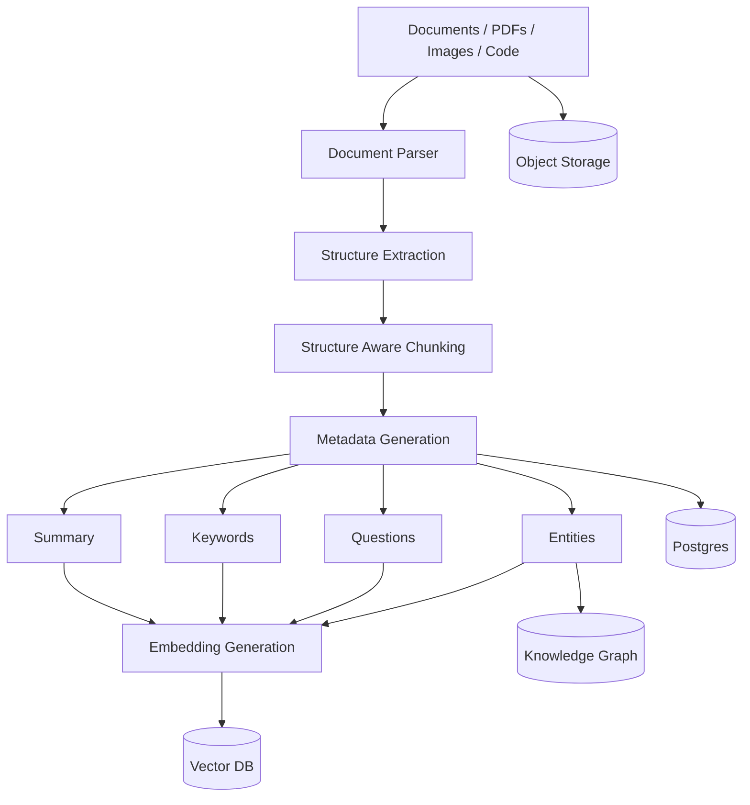
</details>


### Query Understanding Subsystem

Analyzes and standardizes incoming queries by scanning for PII, classifying user intent, and dynamically rewriting or expanding queries to generate optimal search terms.

<details>
<summary><b>Click to expand Query Understanding Subsystem Diagram</b></summary>

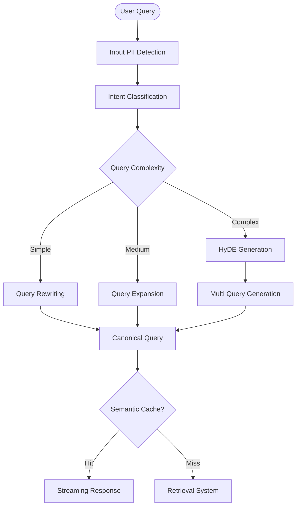
</details>

### Hybrid Retrieval Subsystem

Combines dense vector search, sparse keyword search (FTS), and knowledge graph queries. Filters results by metadata, fuses them via RRF, and applies cross-encoder reranking and compression.

<details>
<summary><b>Click to expand Hybrid Retrieval Subsystem Diagram</b></summary>

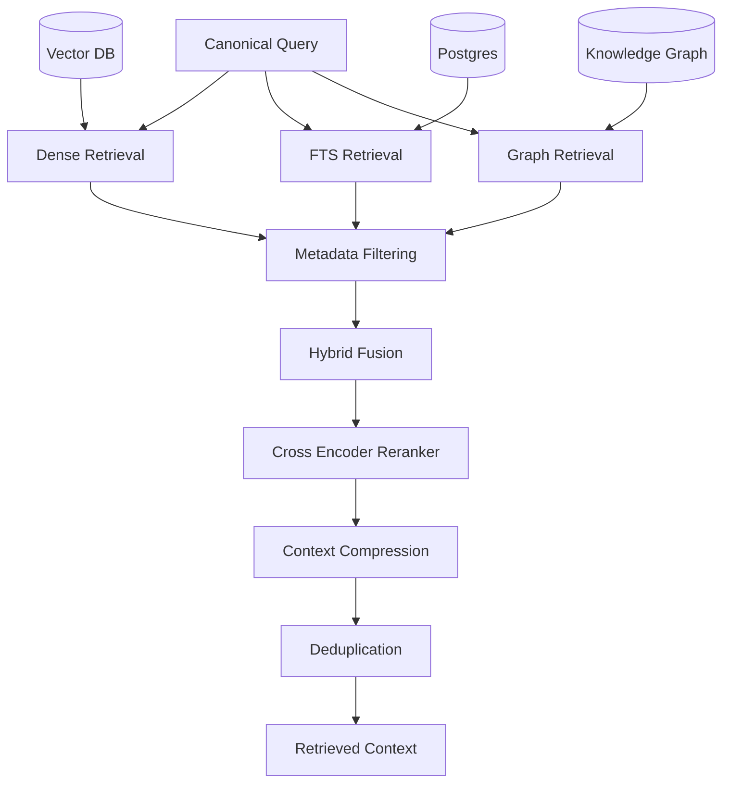
</details>

### Agentic Reasoning Subsystem

Executes task planning and tools autonomously. Employs a reasoning loop to decompose queries, select appropriate tools, inspect results, and retrieve additional evidence if required.

<details>
<summary><b>Click to expand Agentic Reasoning Subsystem Diagram</b></summary>

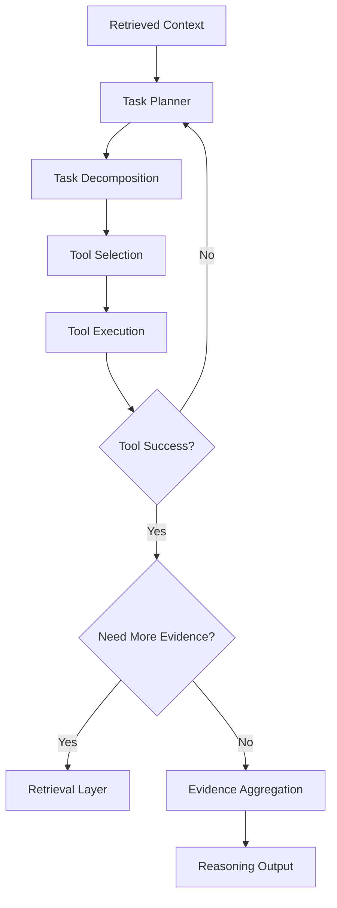
</details>

### Context Engineering Subsystem

Assembles the final model prompt. Standardizes retrieved snippets, compresses redundant contexts, and injects clear citation indexes to ensure transparent references.

<details>
<summary><b>Click to expand Context Engineering Subsystem Diagram</b></summary>

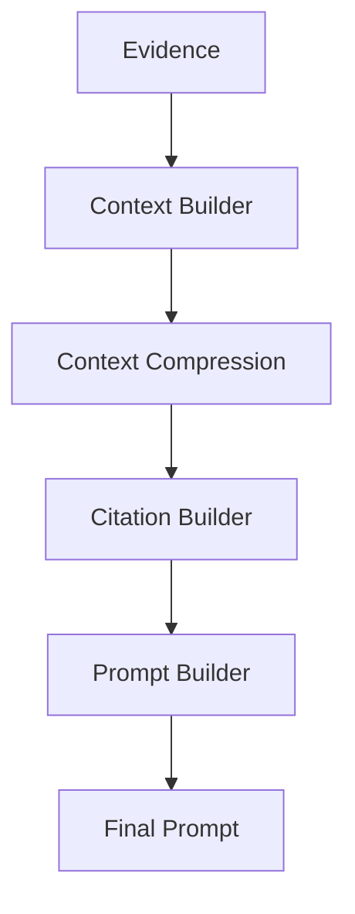
</details>

### Generation & Validation Subsystem

Processes inputs using reasoning LLMs and enforces structured output formats (e.g., Pydantic schemas). Validates safety (PII, toxicity) and verifies grounding to catch hallucinations.

<details>
<summary><b>Click to expand Generation & Validation Subsystem Diagram</b></summary>

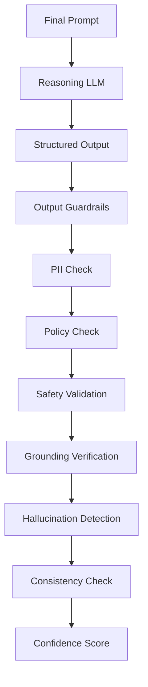
</details>

### Human Review Subsystem

Provides a safety-net queue for low-confidence model responses, routing queries for human validation and approval before caching and delivering streamed responses to users.

<details>
<summary><b>Click to expand Human Review Subsystem Diagram</b></summary>

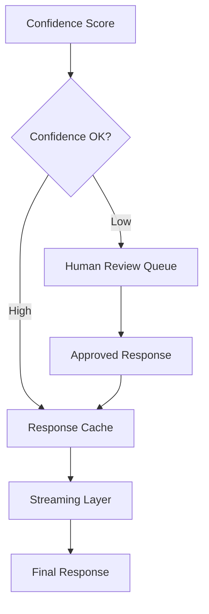
</details>

### Observability Subsystem

Monitors system health and tracing endpoints. Traces call chains using OpenTelemetry, aggregates log streams, and tracks latency, costs, and token consumption metrics.

<details>
<summary><b>Click to expand Observability Subsystem Diagram</b></summary>

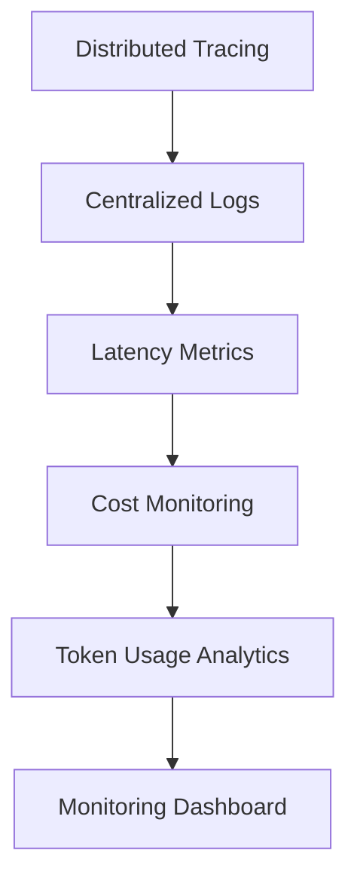
</details>

### Evaluation Subsystem

Evaluates system accuracy using production log traces. Measures precision, recall, faithfulness, and answer relevance via a benchmark suite and automated LLM Judges.

<details>
<summary><b>Click to expand Evaluation Subsystem Diagram</b></summary>

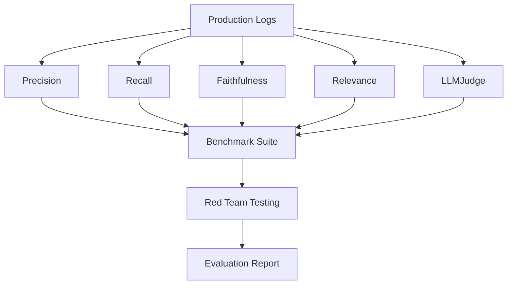
</details>

### Continuous Improvement Subsystem

Closes the feedback loop by writing log metrics and human reviews to a central store, driving automated fine-tuning datasets, prompt optimizations, and retriever updates.

<details>
<summary><b>Click to expand Continuous Improvement Subsystem Diagram</b></summary>

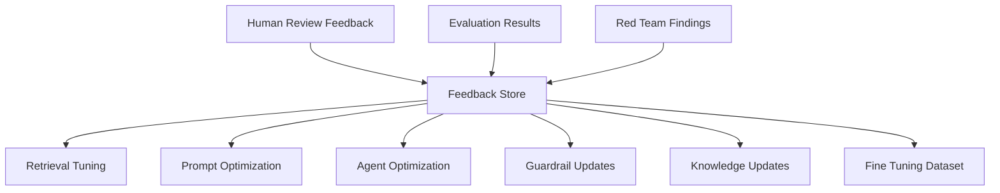
</details>


## Getting Started

This repository uses **Python 3.12** and **`pyproject.toml`** for dependency and project configuration. We recommend using **`uv`** for extremely fast virtual environment setup and dependency resolution.

### Installation & Environment Setup

1. **Create the virtual environment (using Python 3.12):**
   ```bash
   uv venv --python 3.12
   ```

2. **Activate the environment:**
   ```bash
   source .venv/bin/activate
   ```

3. **Install dependencies (including development tools):**
   ```bash
   uv sync --extra dev
   ```

4. **Configure environment variables:**
   Copy the configuration template and populate your local variables:
   ```bash
   cp .env.template .env
   ```

### Project Structure

Below is the directory layout established for Stage 0 (Foundation & Project Setup):

```text
RAG2Prod/
├── src/                          # Application source root
│   ├── main.py                   # FastAPI application entry point
│   └── core/                     # Central system configurations and contracts
│       ├── __init__.py
│       ├── config.py             # Settings loader via pydantic-settings
│       └── schemas.py            # Centralized Pydantic schemas (all shared models live here)
│
├── tests/                        # Automated testing suite
│   ├── __init__.py
│   ├── conftest.py               # Shared pytest fixtures
│   └── test_sanity.py            # Sanity test to verify pytest works correctly
```

## Developer Guidelines & Guardrails

To build this production RAG application successfully with AI agents, follow these core guardrails:

### 1. Interface-First Gating
* Before implementing logic, define all shared models, schemas, and function signatures in `src/core/schemas.py`.
* Always import and inherit from these shared schemas. Do not write custom inline dictionaries or ad-hoc data models in service layers. This prevents interface drift across files.

### 2. Test-Driven Development (TDD)
* Before writing any backend or service layer implementation, write a failing unit test first.
* Verify that the test fails, write the minimum implementation code to make it pass, and then verify the test passes.
* Run tests manually to verify component integration (auto-tests are disabled to give developer control):
  ```bash
  pytest
  ```

### 3. Stop & Revert Rule (Troubleshooting)
* If you fail to resolve a bug or test failure after **two consecutive attempts**, or find yourself modifying files outside the immediate active task scope: **STOP**.
* Revert all modified files (`git checkout -- <file>`) and explain the root cause in plain text before writing any further code.

### 4. Git Commit Conventions
When committing changes, use Conventional Commit messages in the format `<type>(<scope>): <description>` (scope is optional and minimal):
* **`feat(<scope>)`**: Introducing new user-facing capabilities, routes, or modules (e.g., `feat(core): added microsoft and discord oauth`, `feat(prototype): add main app orchestrator...`).
* **`chore(<scope>)`**: Routine maintenance tasks such as updating dependencies (`pyproject.toml`), lockfiles (`uv.lock`), or configuring system parameters (e.g., `chore(config): update environment keys`).
* **`fix(<scope>)`**: Resolving validation issues, bug fixes, or framework quirks (e.g., `fix(auth): resolve cookie path boundary issue`).
* **`docs(<scope>)`**: Modifying or creating files containing instructional details (e.g., `docs: finalize project environment configurations`).
* **`refactor(<scope>)`**: Cleanups or adjustments to code structure that do not change external logic (e.g., `refactor(db): streamline pool initialization`).

## Repository Governance & AI Alignment Setup

To ensure AI assistants (like Cursor, Cline, or Gemini) stay strictly aligned with the repository's architecture without bloating their context windows, the following system was implemented in this session:

### 1. Central Routing: `.cursorrules`
The root [`.cursorrules`](.cursorrules) file configures the coding assistant's instructions and forces it to use the modular standards folder before writing any code.

### 2. Modular Rules Directory: `.rules/`
All guidelines are broken down into domain-specific rules inside the [`.rules/`](.rules/) directory. The assistant loads these only when relevant to the task, minimizing token bloat:
* **[`current_task.md`](.rules/current_task.md)** — The active stage checklist and schema specifications. The assistant updates this file dynamically as it checks items off.
* **[`python_standards.md`](.rules/python_standards.md)** — Code styling, type hints, and the *Interface-First* design rule (defining shared Pydantic models in `src/core/schemas.py`).
* **[`api_design.md`](.rules/api_design.md)** — Versioned path rules (e.g. `/api/v1`) and structured HTTP error responses.
* **[`chunking_standards.md`](.rules/chunking_standards.md)** — Target token sizing, overlap guidelines, and parent-child chunk mapping.
* **[`database_rules.md`](.rules/database_rules.md)** — Database connection pooling and Pgvector index similarity distance rules.
* **[`prompt_guidelines.md`](.rules/prompt_guidelines.md)** — System prompt structures, validation templates, and structured output parsing.
* **[`security_standards.md`](.rules/security_standards.md)** — Masking rules for PII (Microsoft Presidio) and Row-Level Security on databases.
* **[`observability_standards.md`](.rules/observability_standards.md)** — Logging guidelines (central JSON logs) and tracing formats (W3C Trace Context).
* **[`testing_policies.md`](.rules/testing_policies.md)** — Guidelines for mocking API calls and running automated LLM Judges.
* **[`deployment_rules.md`](.rules/deployment_rules.md)** — Docker container constraints, multi-stage building, and system health checks.


