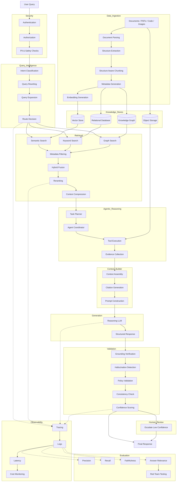
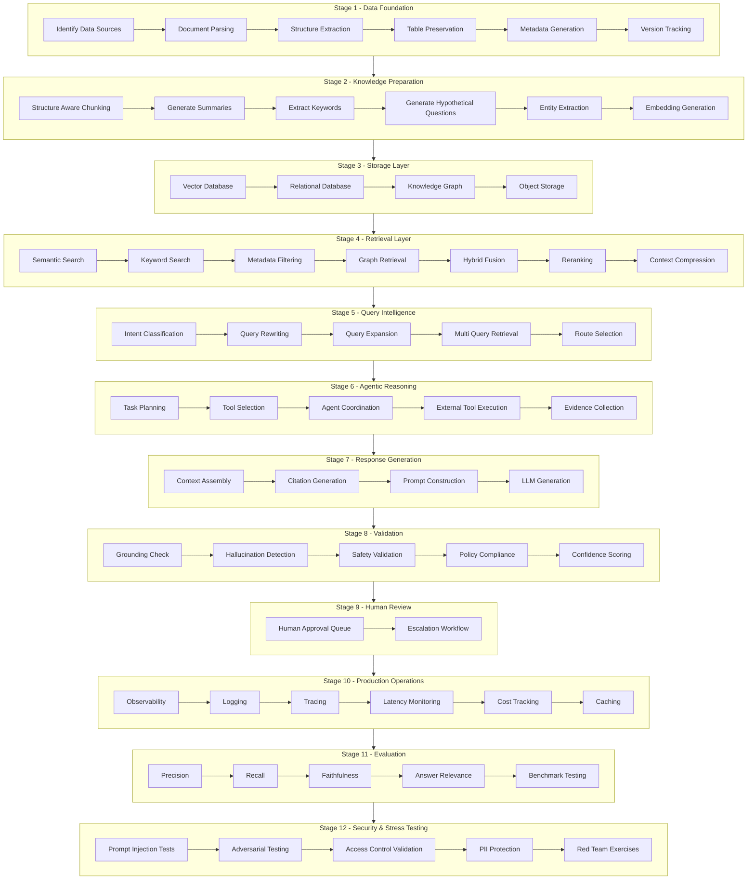

# RAG2Prod
Building an Agentic RAG System from Prototype to Production

## System Design

```mermaid
flowchart TD

%% USER REQUEST

U[User Query]

%% SECURITY GATE

subgraph Security
    S1[Authentication]
    S2[Authorization]
    S3[PII & Safety Checks]
end

%% QUERY UNDERSTANDING

subgraph Query_Intelligence
    Q1[Intent Classification]
    Q2[Query Rewriting]
    Q3[Query Expansion]
    Q4[Route Decision]
end

%% RETRIEVAL

subgraph Retrieval
    R1[Semantic Search]
    R2[Keyword Search]
    R3[Graph Search]
    R4[Metadata Filtering]
    R5[Hybrid Fusion]
    R6[Reranking]
    R7[Context Compression]
end

%% AGENTIC LAYER

subgraph Agentic_Reasoning
    A1[Task Planner]
    A2[Agent Coordinator]
    A3[Tool Execution]
    A4[Evidence Collection]
end

%% KNOWLEDGE LAYER

subgraph Knowledge_Stores
    K1[(Vector Store)]
    K2[(Relational Database)]
    K3[(Knowledge Graph)]
    K4[(Object Storage)]
end

%% CONTEXT BUILDING

subgraph Context_Builder
    C1[Context Assembly]
    C2[Citation Generation]
    C3[Prompt Construction]
end

%% GENERATION

subgraph Generation
    G1[Reasoning LLM]
    G2[Structured Response]
end

%% VALIDATION

subgraph Validation
    V1[Grounding Verification]
    V2[Hallucination Detection]
    V3[Policy Validation]
    V4[Consistency Check]
    V5[Confidence Scoring]
end

%% HUMAN REVIEW

subgraph Human_Review
    H1[Escalate Low Confidence]
end

%% OUTPUT

O[Final Response]

%% MAIN FLOW

U --> S1
S1 --> S2
S2 --> S3

S3 --> Q1
Q1 --> Q2
Q2 --> Q3
Q3 --> Q4

Q4 --> R1
Q4 --> R2
Q4 --> R3

K1 --> R1
K2 --> R2
K3 --> R3

R1 --> R4
R2 --> R4
R3 --> R4

R4 --> R5
R5 --> R6
R6 --> R7

R7 --> A1
A1 --> A2
A2 --> A3
A3 --> A4

K4 --> A3

A4 --> C1
C1 --> C2
C2 --> C3

C3 --> G1
G1 --> G2

G2 --> V1
V1 --> V2
V2 --> V3
V3 --> V4
V4 --> V5

V5 --> H1
V5 --> O

H1 --> O

%% INGESTION PIPELINE

subgraph Data_Ingestion
    D1[Documents / PDFs / Code / Images]
    D2[Document Parsing]
    D3[Structure Extraction]
    D4[Structure Aware Chunking]
    D5[Metadata Generation]
    D6[Embedding Generation]
end

D1 --> D2
D2 --> D3
D3 --> D4
D4 --> D5
D5 --> D6

D6 --> K1
D5 --> K2
D5 --> K3
D1 --> K4

%% OBSERVABILITY

subgraph Observability
    M1[Tracing]
    M2[Logs]
    M3[Latency]
    M4[Cost Monitoring]
end

Q4 -.-> M1
R6 -.-> M1
G1 -.-> M1
V5 -.-> M1

M1 --> M2
M2 --> M3
M3 --> M4

%% EVALUATION

subgraph Evaluation
    E1[Precision]
    E2[Recall]
    E3[Faithfulness]
    E4[Answer Relevance]
    E5[Red Team Testing]
end

M2 -.-> E1
M2 -.-> E2
M2 -.-> E3
M2 -.-> E4
E4 --> E5

```

## System Life

```mermaid
flowchart TD

%% STAGE 1

subgraph S1["Stage 1 - Data Foundation"]
    A1[Identify Data Sources]
    A2[Document Parsing]
    A3[Structure Extraction]
    A4[Table Preservation]
    A5[Metadata Generation]
    A6[Version Tracking]
end

A1 --> A2 --> A3 --> A4 --> A5 --> A6

%% STAGE 2

subgraph S2["Stage 2 - Knowledge Preparation"]
    B1[Structure Aware Chunking]
    B2[Generate Summaries]
    B3[Extract Keywords]
    B4[Generate Hypothetical Questions]
    B5[Entity Extraction]
    B6[Embedding Generation]
end

B1 --> B2 --> B3 --> B4 --> B5 --> B6

%% STAGE 3

subgraph S3["Stage 3 - Storage Layer"]
    C1[Vector Database]
    C2[Relational Database]
    C3[Knowledge Graph]
    C4[Object Storage]
end

C1 --> C2 --> C3 --> C4

%% STAGE 4

subgraph S4["Stage 4 - Retrieval Layer"]
    D1[Semantic Search]
    D2[Keyword Search]
    D3[Metadata Filtering]
    D4[Graph Retrieval]
    D5[Hybrid Fusion]
    D6[Reranking]
    D7[Context Compression]
end

D1 --> D2 --> D3 --> D4 --> D5 --> D6 --> D7

%% STAGE 5

subgraph S5["Stage 5 - Query Intelligence"]
    E1[Intent Classification]
    E2[Query Rewriting]
    E3[Query Expansion]
    E4[Multi Query Retrieval]
    E5[Route Selection]
end

E1 --> E2 --> E3 --> E4 --> E5

%% STAGE 6

subgraph S6["Stage 6 - Agentic Reasoning"]
    F1[Task Planning]
    F2[Tool Selection]
    F3[Agent Coordination]
    F4[External Tool Execution]
    F5[Evidence Collection]
end

F1 --> F2 --> F3 --> F4 --> F5

%% STAGE 7

subgraph S7["Stage 7 - Response Generation"]
    G1[Context Assembly]
    G2[Citation Generation]
    G3[Prompt Construction]
    G4[LLM Generation]
end

G1 --> G2 --> G3 --> G4

%% STAGE 8

subgraph S8["Stage 8 - Validation"]
    H1[Grounding Check]
    H2[Hallucination Detection]
    H3[Safety Validation]
    H4[Policy Compliance]
    H5[Confidence Scoring]
end

H1 --> H2 --> H3 --> H4 --> H5

%% STAGE 9

subgraph S9["Stage 9 - Human Review"]
    I1[Human Approval Queue]
    I2[Escalation Workflow]
end

I1 --> I2

%% STAGE 10

subgraph S10["Stage 10 - Production Operations"]
    J1[Observability]
    J2[Logging]
    J3[Tracing]
    J4[Latency Monitoring]
    J5[Cost Tracking]
    J6[Caching]
end

J1 --> J2 --> J3 --> J4 --> J5 --> J6

%% STAGE 11

subgraph S11["Stage 11 - Evaluation"]
    K1[Precision]
    K2[Recall]
    K3[Faithfulness]
    K4[Answer Relevance]
    K5[Benchmark Testing]
end

K1 --> K2 --> K3 --> K4 --> K5

%% STAGE 12

subgraph S12["Stage 12 - Security & Stress Testing"]
    L1[Prompt Injection Tests]
    L2[Adversarial Testing]
    L3[Access Control Validation]
    L4[PII Protection]
    L5[Red Team Exercises]
end

L1 --> L2 --> L3 --> L4 --> L5

%% MAIN FLOW

S1 --> S2
S2 --> S3
S3 --> S4
S4 --> S5
S5 --> S6
S6 --> S7
S7 --> S8
S8 --> S9
S9 --> S10
S10 --> S11
S11 --> S12

```