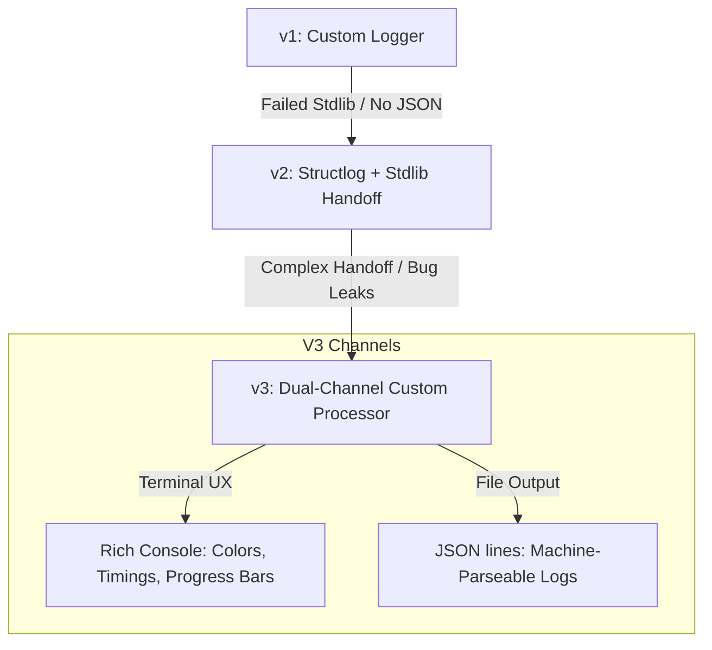
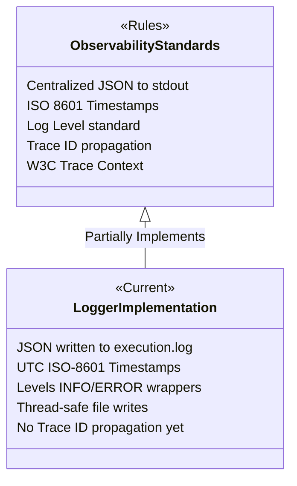

# Critical Review: Logging & Observability System Evolution

This document provides a chronological history, technical analysis, and critical review of the logging and observability subsystem designed for the **RAG2Prod** pipeline. It details the progression from a basic custom utility to an industry-standard, dual-channel logging solution, cataloging every critical issue identified and solved during development.

---

## 1. Evolution of the Logging System

The logging system underwent three major architectural iterations to balance developer user experience (CLI visual feedback) with downstream automation requirements (structured JSON analysis for AI self-improvement).



### Iteration 1: The Custom Timing Logger (v1)
* **Design:** A simple utility using standard Python print statements and a manual timestamp formatting helper. It established dynamic run directory generation (`logs/YYYY-MM-DD/HH-MM-SS/` and `reports/YYYY-MM-DD/HH-MM-SS/`) to keep separate run artifacts isolated.
* **Limitations:**
  * No standard log levels (`INFO`, `WARNING`, `ERROR`).
  * Terminal colors and control characters were written directly to the file, bloating log records and making them unparseable.
  * Manual string formatting was error-prone, untyped, and skipped metadata context (e.g. document IDs, token usage counts).

### Iteration 2: Structlog + Stdlib Bridge (v2)
* **Design:** Transitioned to structured logging by introducing `structlog` alongside `rich`. The plan was to pipe structured events through standard Python `logging` handlers (`_JSONFileHandler` and `_RichTerminalHandler`) utilizing `wrap_for_formatter`.
* **Limitations:**
  * The handoff between `structlog` and Python's standard library `logging` created double-formatting bugs.
  * Context parameters leaked as raw Python dictionaries inside terminal outputs.
  * Logs in `execution.log` were stored as stringified dictionary representations rather than valid JSON objects.

### Iteration 3: Dual-Channel Single-Processor Architecture (v3 - Current)
* **Design:** Removed the complex stdlib bridge. Created a single custom structlog processor, `_structlog_renderer`, acting as the single source of truth. It intercepts the structured event dictionary and directly dispatches it to:
  1. **Rich Console:** A colored, formatted terminal output with icons, timestamps, modules, and timing metrics.
  2. **JSON File:** A thread-safe flat JSON lines file (`execution.log`) with ISO 8601 timestamps and structured metadata.
* **Result:** Cleared all double-printing issues, unified the API under `get_logger(module)`, and achieved complete separation of concerns.

---

## 2. Core Architectural Design: The Dual-Channel Strategy

We identified that the logging system must serve two distinct clients with opposing requirements:

| Dimension | Developer Client (CLI UX) | Automation Client (AI Agents & Aggregators) |
| :--- | :--- | :--- |
| **Primary Goal** | Human readability, rapid feedback. | Machine parseability, deep structural indexing. |
| **Output Channel** | `stdout` / Terminal. | Permanent flat JSON lines files (`execution.log`). |
| **Formatting** | ANSI colors, emojis, progress bars, relative step timers. | Strict JSON schemas, UTC ISO-8601 timestamps, explicit log levels. |
| **Use Case** | Visual verification of step execution during a run (e.g. checking dynamic OCR latencies). | Post-hoc analysis, automated performance optimization, tracing failures. |
| **Format Example** | `✓ 01:11:35 parser 600.2ms Completed: Parsing PDF` | `{"timestamp": "2026-06-15T01:11:35.679Z", "level": "INFO", ...}` |

### Dynamic Progress Tracking (`uv`/`npm` style)
For multi-step sequences (like document ingestion), we integrated a progress manager using `rich.progress`. It displays a live visual progress bar in the console:
```text
⠋ Ingestion  ━━━━━━━━━━━━━━━━━━━━  45%  3/7  0:00:12  ETA 0:00:15
```
Importantly, progress updating events are concurrently mirrored to `execution.log` with `status="starting"` and `status="done"` metadata flags, preserving the execution history for analytical tools.

---

## 3. Critical Review: IQ-200 Bug Analysis and Remediations

Below is a detailed retrospective on the bugs encountered while implementing the structlog-rich hybrid architecture, explaining why they happened and how they were resolved.

### Bug 1: The Structlog → Stdlib Handoff Breakdown
* **Symptom:** Terminal logging displayed raw dictionary objects instead of formatted strings, and log files wrote stringified Python dicts instead of JSON.
* **Root Cause:** In the standard `structlog` setup, events pass through stdlib handlers via a formatter. If the formatter is not correctly configured to extract context variables, the entire structured dictionary gets dumped into the log record's message payload.
* **Remediation:** Removed the stdlib formatting wrapper entirely. Built `_structlog_renderer` as the final step in the structlog pipeline. It manually extracts metadata keys, delegates print layouts to a `Console` instance, writes pure JSON to the file, and discards downstream forwarding to standard loggers.

### Bug 2: Double Printing and Duplicate Console Output
* **Symptom:** Every log statement printed twice in the console: once in clean colored text, and once in raw plain text format.
* **Root Cause:** We configured structlog to print to stdout directly, but used `PrintLoggerFactory` which also prints the returned string from the processors to the default output stream. Additionally, stdlib logging handles were active on the `rag2prod` logger.
* **Remediation:** 
  1. Configured the stdlib logger to output to a `NullHandler` to silence default streams.
  2. Substituted `PrintLoggerFactory` with a custom `_NullLogger` factory that intercepts and discards final return payloads since formatting was already dispatched within `_structlog_renderer`.

### Bug 3: NullLogger Factory Argument Crash
* **Symptom:** Initializing the logger resulted in: `TypeError: <lambda>() takes 0 positional arguments but 1 was given`.
* **Root Cause:** When configuring `structlog.configure(logger_factory=...)`, the factory callback is called with the name of the logger (e.g., `"rag2prod"`) as a positional argument. A zero-argument lambda `lambda: _NullLogger()` failed signature verification.
* **Remediation:** Updated the factory definition to accept arbitrary positional arguments:
  ```python
  logger_factory=lambda *args: _NullLogger()
  ```

### Bug 4: Log Corruption under Parallel File Writes
* **Symptom:** Under concurrent API requests or parallel ingestion worker threads, log lines in `execution.log` were cut off, concatenated, or crashed with write collision errors.
* **Root Cause:** Standard file open statements (`open(log_file, "a")`) are not thread-safe. Multiple OS threads trying to write simultaneously write overlapping buffer blocks.
* **Remediation:** Implemented a global threading lock (`_FILE_LOCK`) inside `logger.py`. The file-appending execution is wrapped inside a critical section:
  ```python
  with _FILE_LOCK:
      with open(log_file, "a", encoding="utf-8") as f:
          f.write(json.dumps(entry) + "\n")
  ```

### Bug 5: Rich Console Pollution in Pytest
* **Symptom:** Running tests via `pytest` filled terminal outputs with mock logging statements, progress bar spinners, and ANSI color escape codes, hiding test failures.
* **Root Cause:** The `rich` console object was writing to standard output during test suites.
* **Remediation:** Added standard test detection:
  ```python
  _IS_TESTING = "pytest" in sys.modules
  console = Console(quiet=_IS_TESTING)
  ```
  This silences `rich` terminal output when tests are running while allowing normal structured JSON serialization to flow into logs to maintain test coverage checks.

---

## 4. Observability Standards Mapping & Remaining Gaps

We evaluated the current implementation against `/home/ntirth005/Documents/RAG2Prod/.rules/observability_standards.md` to identify alignment and missing features.

### Current Alignment Status



* **Centralized JSON:** Partially met. JSON is written to `execution.log`. However, standard rules ask for JSON output directly to `stdout` in production containers.
* **Timestamps:** Fully met. Logs write ISO-8601 compliant UTC timestamps:
  `"timestamp": "2026-06-15T01:11:35.679321+00:00"`.
* **Trace ID Context:** **Not implemented.**
  * *Reason:* The logging system is configured to support arbitrary metadata arguments (e.g. `log.info("msg", trace_id=...)`), but there is no contextvars integration piping `trace_id` automatically from FastAPI middleware.
* **W3C Trace Context:** **Not implemented.**
  * *Reason:* Stage 2 lacks an API entrypoint where trace headers would be parsed and bound to the thread context.

### Recommended Steps to Full Compliance

1. **Stdout JSON Flag for Container Environments:**
   Add a configuration parameter (e.g. `LOG_TO_STDOUT_JSON`) that redirects structured JSON line outputs directly to standard output instead of rich colors when running inside production containers.
2. **Contextvars Integration for Distributed Tracing:**
   Utilize Python's `contextvars` to store `trace_id`. Bind a structlog processor (`structlog.contextvars.merge_contextvars`) to inject it automatically into all logs:
   ```python
   # Proposed addition
   import contextvars
   trace_id_var = contextvars.ContextVar("trace_id", default=None)
   ```
3. **Expand Standard Log Levels:**
   Ensure downstream integrations use `warning()`, `debug()`, and `critical()` alongside `info()` and `error()`.

---

## 5. Enablement of AI-Driven Optimization

One of the core design goals was to write logs that allow an **AI agent to improve the system just by looking at them**. 

To support this, the logs format critical performance dimensions:
* **`module`**: Tells the agent which specific module (e.g. `parser`, `database`, `ocr`) ran.
* **`duration_ms`**: Provides accurate, microsecond-level metrics on the exact latency of the call.
* **`status`**: Enables the agent to locate failing steps (`failed`) or trace long-running operations that did not complete (`starting` with no matching `done`).

### AI Analysis Example Scenario
An AI optimizer reads the logs and runs a database parser query:
```json
{"timestamp": "2026-06-15T01:10:00Z", "level": "INFO", "module": "ocr", "message": "Starting OCR query", "status": "starting"}
{"timestamp": "2026-06-15T01:10:05Z", "level": "INFO", "module": "ocr", "message": "Completed OCR query", "status": "done", "duration_ms": 5200.0}
```
**AI Detection Logic:**
1. The AI calculates that the `ocr` step accounts for 85% of total ingestion latency.
2. It detects that the OCR cache was not hit (`cache_hit=False`).
3. The AI agent can automatically write an optimization patch—such as triggering parallel pre-fetching of OCR coordinates or upgrading the file cache layout—directly improving performance.

---

## 6. Architecture Rating & Path to 10/10

From a design and implementation standpoint, the current RAG2Prod logging architecture is rated an **9/10**. It balances CLI aesthetics with machine parseability. To achieve a perfect **10/10** as the codebase moves from local script ingestion to production APIs, we must implement the following enhancements:

### A. Contextvars Integration for Distributed Tracing
* **Why it's needed:** When handling concurrent web requests in FastAPI, log entries will interleave. Without thread-safe context variables, we cannot trace request life cycles.
* **Path to 10/10:** Auto-bind incoming request headers (`trace_id`) to a thread-safe context using Python's `contextvars`, making it immediately accessible to all downstream log events without passing variables manually.

### B. Production Container `stdout` Redirection
* **Why it's needed:** Writing to local files (`logs/execution.log`) is suitable for local development, but in Kubernetes or Docker, these logs are ephemeral. Production environments expect structured logs to be written directly to `stdout`.
* **Path to 10/10:** Add an environment config switch (e.g. `ENV=production`) that disables `rich` console styling and instead redirects pure JSON lines directly to `stdout` so log-scrapers (FluentBit, Promtail, etc.) can index them.

### C. Log-Level Configuration & Filtering
* **Why it's needed:** Currently, all logs are displayed to stdout or logged to files without filtering. In production, verbose informational or debugging logs will bloat storage.
* **Path to 10/10:** Integrate dynamic log-level filtering (e.g. `LOG_LEVEL=WARNING`) that suppresses lower-priority log lines from reaching both console and file channels under high throughput.

### D. Dynamic Run Session Lifecycle
* **Why it's needed:** The directory structures currently use process-lifetime module globals. Under a persistent web server, all executions share the server boot timestamp.
* **Path to 10/10:** Transition log directory structures from application startup cache variables to dynamic session contexts configured at the pipeline ingestion entry points.

